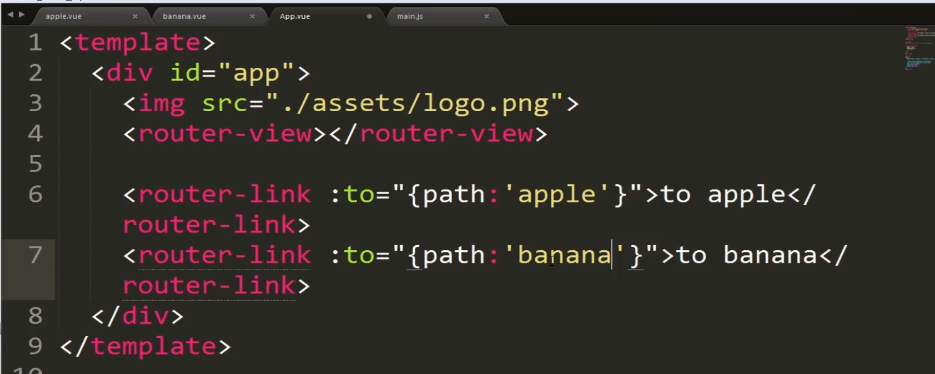
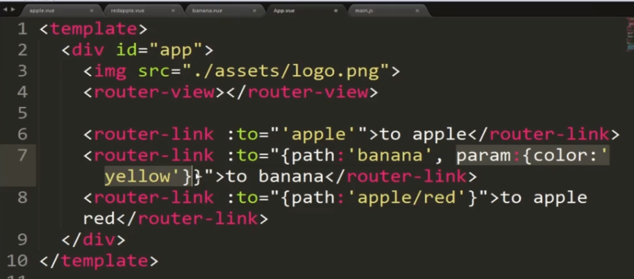

这一章是对前端路由知识点的一个总结。
## Vue-router

### 什么是路由？
> * 路由就是根据不同的地址跳到不同的页面
> * 应用场景：单页面应用

### 前端路由与传统路由的比较
> * 传统路由切换的时候，所有资源都需要重新请求一次
> * 前端路由，单页面公用一些资源，只需要请求需要请求的页面

## 使用前端路由
> * 安装：npm install vue-router --save
> * 在入口文件里引入，注册

### vue-router的关键点
> * 规定要有要有一份Map，规定什么地址访问什么页面/组件
> * **<router-view>**在哪个位置、区域显示
> * **<router-link>**在页面上如何跳转到下一个页面

### 实例化路由类，插到项目的根的Vue实例里
> * 
> * 实例化router的时候，通过routes选项来进行设定，做一份映射表
	> * 引入组件，在routes中有path和component两个属性，互相对应 
> * 配置好入口文件后，需要规定在哪里，通过**<router-view>**的放置地点来规定
> * Vue处理非html5路由采用的方式：采用哈希#，可以接受前后的切换。在默认状态下加了哈希#，也就是说当前路由没有使用html5的history功能，通常是高级浏览器的话，可以在实例化时，routes中添加mode的history属性，来支持前后退的功能
> *  
> * 在页面里的跳转：通过**<router-link :to="{path:'apple'}">**来跳转到相应的地址
> * 

### 路由的参数         
> * 前端路由允许传参，在实例化时设置参数
> * 
> * 设定参数后，如何在组件内部获取参数呢？
> * 路由接受了参数以后，会往每个组件的全局route对象里插入当前页面的参数params，所以可以通过**this.$route.params**来获取当前路由的参数
> * 需要注意的，由于在路由里设定了有参数的路由，所以这是一个特定的匹配，加入输入的路由后面没有参数的话，就不会到想去的那个路由页面
> * 由于**this.$route.params**已经被注入了，所以自动成为组件的一个属性，可以在模板里直接访问**$route.params.color**
> * 
> * 路由参数的灵活使用：带冒号的都是参数，不带的会进行字符串匹配
> * 

### 路由嵌套
> * 就是自路由，同样配置映射表，只是在父级路由下配置children映射表
> * 
> * 子路由组件渲染在哪里呢？它只会渲染到父级路由组件里面，不会插在根的**<router-view>**的位置。因为它只能找到父组件的那一层，所以我们需要在父组件相应位置放一个**<router-view>**,用以放置子路由组件。**<router-view>**所在地
> * 

### 命名的路由视图、路由重定向
> * **<router-link>**如果只是一个简单的跳转，我们可以采用**to**+地址，不需要用**v-bind**来绑定，类似于**href**，基于当前路径跳到指定路径
> * **to**可以将自定义的参数直接传过去。
> * 
> * 具名路由：在设定路由的时候，设定name属性，在访问的时候，也通过name属性来访问。
> * 
> * 如何让将**<router-link>**变成**li**的样式呢？可以通过**tag="li"**来指定
> * 
> * 通过**v-bind**动态的将路径作为组建的一个属性来进行绑定。

### 声明式导航和编程式导航
> * 在组件**<template>**里通过**<router-link>**导航叫做声明式导航，实在模板里进行声明来导航
> * 我们在main.js里也可以进行编程式的导航，采用的最基本的方法是通过**router.push()**方法，指定到特殊页面。
> * 
### 命名的路由和命名的视图
> * 命名路由
> * 命名视图
> * 
> * 

### 路由重定向
> * 当访问某个路径时，重定向到指定的路径
> * 

### 使用过渡制作路由跳转动画