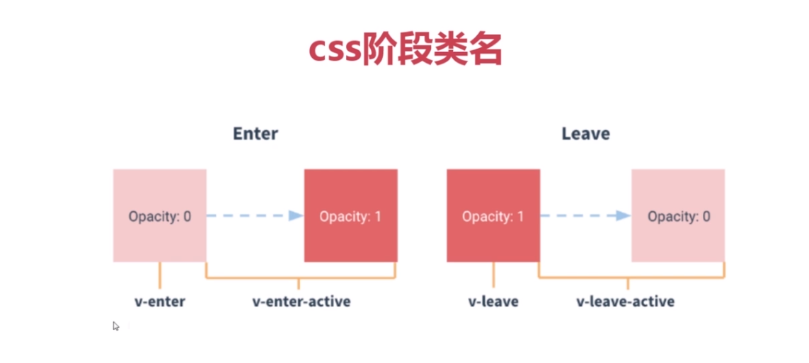
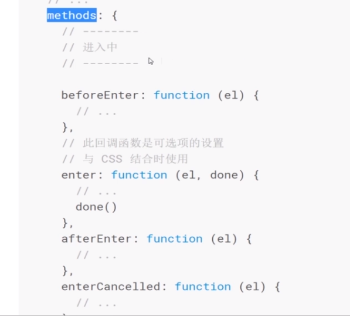
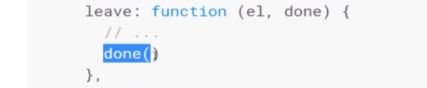

依旧等待面试中。。今学习Vue动画过渡相关知识，之前学习过，但是有些地方不是很懂，没有很好的串起来，今天再来一次。
## Vue的高级功能
> * 过渡
> * 自定义指令
> * mixins
> * 插件

## Vue：过渡、动画
> * 通过v-show来控制dom元素的展示，过渡就是在切换展示的过程中加一些动画
> * ```<transition>```是vue提供的内置组件，但必须配合一些特定条件才能用，如v-show。它本身需要命名，之后才可以根据它的名字实现过渡效果
> * 实现过渡的两种方法：CSS实现过渡、JS实现过渡

## Vue：CSS实现过渡

> * 在接受过渡效果元素的时候，vue的```<transition>```组件会给这个元素不同阶段赋予不同的类名，我们通过控制CSS就可以实现过渡、动画
> * 类名主要分两个阶段：
	> * 进入阶段--从无到有。比如v-show从不显示到显示阶段，有两个过程：完全不显示的时候，得到v-enter类名。进入显示过程中，类名为：v-enter-avtive
	> * 离开阶段--完全有的时候：v-leave，当进入到完全不展示的过程中：v-leave-active类名
> * enter-active和leave-avtive在css3的动画里，可以通过**transition**属性指定当前元素过渡效果.**transition**接受的两个参数，一个指哪些属性要接受过渡（all,opacityd等），另一个是过渡时长，还可以在第三个参数指定过渡曲线
> * 
> * 由于opacity的默认值是1，所以如果需要完全不显示的两个状态v-enter、v-leave-avtive:得把opacity需要设置值为0.
> * transition的参数，设置left等属性是无效的。所以假如说想做从上下左右进来出去的效果，只能通过transfrom：translateY(-500px);等


### Vue过渡的其他知识
> * 什么样的属性接受过渡状态
> * 多元素过渡
> * 多元素过渡 模式

####什么样的属性接受过渡状态
> * 除了v-show可以接受过渡，v-if也可以，只是v-if会把元素从dom节点中删除  
> * 动态组件接受transition：先用v-bind is实现动态组件 ；将挂载点放在transition里。
> * transition默认的模式：mode="in-out":新的先进，旧的后再出去
> * 还可以使用v-if，v-else来实现多元素过渡
> * 多元素显示有一点要注意，当标签名相同时，由于Vue不能区别这两个元素，所以动画可能会失效，所以可以指定一个key来让Vue区别这两个元素

------

## Vue：JS实现过渡

> * JS过渡类似CSS过渡，也会分阶段。与CSS不同的是，用JS实现时，所控制的阶段，是通过事件(transition组件中的v-on)来监听事件钩子、方法，会在过渡进行到特定的阶段去调用，动画就通过JS写到方法里面。
> * 进入时有：
> * 
> * 离开时有：
> * 
> 要注意的是：
	> * v-bind：css="false",这样可以避免Vue去检查css中指定的选项，可以避免过渡过程中CSS的影响
	> * 方法里带有参数，主要的控制是通过方法传进来的el来实现的。el指当前transition体内的DOM元素，可以设定el的位置、颜色来控制动画
	> * 有两个方法比较特殊，有第二个参数done，一个是enter，一个是leave。done是做什么的呢？当进入完毕后会调用done方法来进行下一步的操iffrent1.png)
	> * 如果要引入一些公用库，如jQuery，可以在index.html文件里面引入，因为这个文件不会被打包或处理，只会作为一个入口的页面往里面加东西


