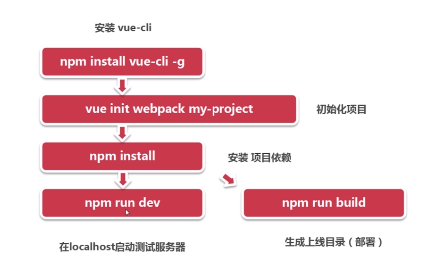

依旧等待面试中。。过两天状态不会变成已回绝了吧。。又期待又害怕的感觉

## Vue的自定义指令
> * 自定义仍采用v-指令名的方式来命名 
> * 实现自定义指令的方式有两种
	> * 在组件里以directives这样的一个选项来设定自定义组件，这个自定义指令是一个局部的指令，只有在这个组件里才能使用
	> * 在main.js里对Vue全局对象来进行一个扩展，使用Vue.directive方法两个参数，第一个是指令名，第二个是对指令的描述（insrted），这个是可以全局使用的指令。
	> * 
	> * 

## Vue：插件
> * vue-resource是用来发送http请求的一个插件，vue-router是前端路由的一个功能
> * 引入之后还需要用Vue.use()注册一下

## Vue：单文件组件和vue-cli

> * 单文件组件的实现是vue-loader配合webpack来实现的
> * Vue-cli的优势
	> * 成熟的Vue项目架构设计
	> * 本地测试服务器
	> * 集成打包上线方案
> * 使用vue-cli的系统要求
	> * node.js(>=4.x)
	> * Git
> * 