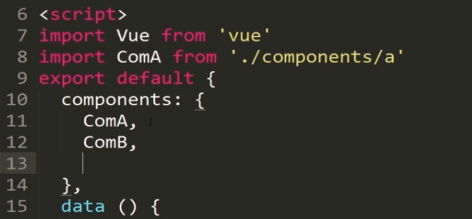
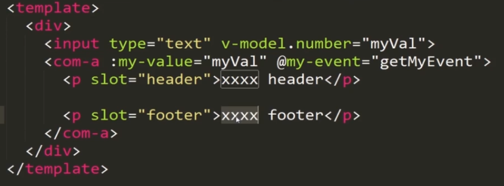

等待面试的过程中真是很焦虑，感觉任何时刻都有可能打电话过来开始面试，最难受的是感觉还有很多没有准备好，所以继续加油。
共勉

## 深入了解Vue组件

* 一个项目通常只有一个根组件，通过实例化一个Vue对象及里面的render方法去渲染根组件。
* 一个项目里只有一个实例化对象，就是入口文件，中间的所有传递其实都是一份配置文件。Vue的所有子组件，包括子组件的子组件都是配置文件。我们用这种方式配合单文件组件，实现Vue的组件树结构。

## 如何在父组件里渲染子组件内容
* 用import模式将子组件的配置载入到父组件的JS里面
 * 响应式-双向绑定：v-model
* 在父组件里注册子组件，通过components注册

  * 
  
* 在template里使用组件，推荐使用-命名转换将大写字母转成小写，因为html标签对大小写不敏感，应该小写
  * 注意，任何往组件里传递的标签、组件属性也不支持大写，需要用-转换
* 模板引入，也可以通过is标签来引入，好处：可以使用动态组件、模板引入。
 
## Vue父子组件之间的通信
* 父子组件遵循怎样的模式呢？

	*  
	
	* 父组件向子组件传递信息通过props：在子组件必须声明props接收的数据，接收到的数据自动变为属性
	* props接受两种类型的值：1.数组（接受数组里列出的所有属性）2.对象：可以指定传值类型 
	* 子组件向父组件传递信息用$emit
* 动态属性的传递
	* 使用v-bind就可以成就一个可以动态向子组件传递的属性，同时属性需要在子组件中声明一下，之后便实现了动态属性的传递
	* 子组件可以设要置接受的数据类型，假若父组件传过来的属性数据类型不匹配，则会触发报错
* 子组件如何通过触发事件向父组件传递信息
	*  子组件中有个button，点击事件可触发myevent事件，同时通过$emit传递了一个字符串参数，在父组件中通过v-on监听一个事件是否被触发，触发时执行相应方法，通过这个方法里接受子组件传过来的的字符串参数。
	*  子组件：
	
		* 
		
	* 父组件
	
		* 

	*  注意，事件也需要-转换大写
* 插槽功能
	* 其实也是父组件向子组件传递信息的一个方式，传递的信息是：模板
	* 在子组件中通过slot标签实现功能，
	* 可以为插槽设置默认值，当插槽没有内容，没有接受到要插进来的信息时，就显示默认值
	* slot也接受具名slot，可以给slot添加name属性，并添加默认值，如果没接收到对应的信息，则显示默认值。
	*  父组件：
	
		* 
		
	* 子组件
	
		* 

## 组件之间的通信-动态组件
* 用v-bind is绑定变量，通过变量来指定不同的组件，就是动态组件
* 动态组件类似于路由，也支持<keep-alive>内置标签，当有好几种组件时，当有<keep-alive>标签，则可以缓存，提高加载速度

## 总结
* 无论多大的项目，组件间进行交互的就是三种方式：通过属性向内传递props、子组件触发$emit事件，父组件通过监听事件来获取信息，插槽功能，写在组件里的模板可以通过插槽展现在子组件的相应位置。
* 使用组件树设计项目，配置文件链接各个组件-命名转换，动态组件
* 父组件向内传递属性-动态属性
* 子组件向外发布事件
* slot插槽传递模板-具名slot